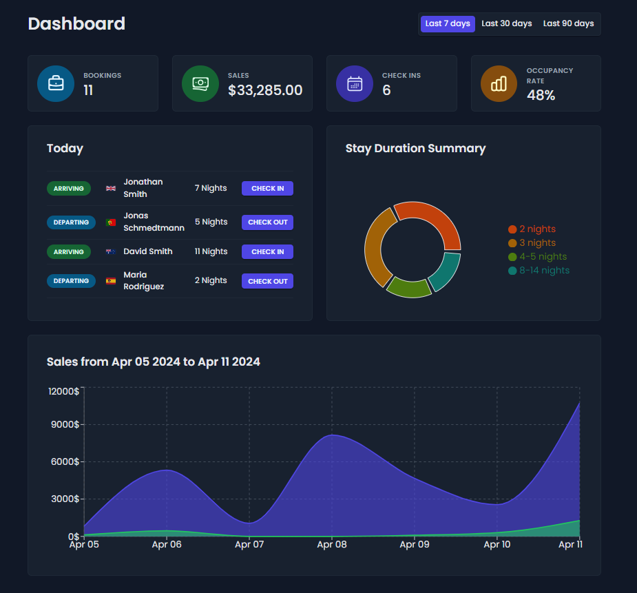
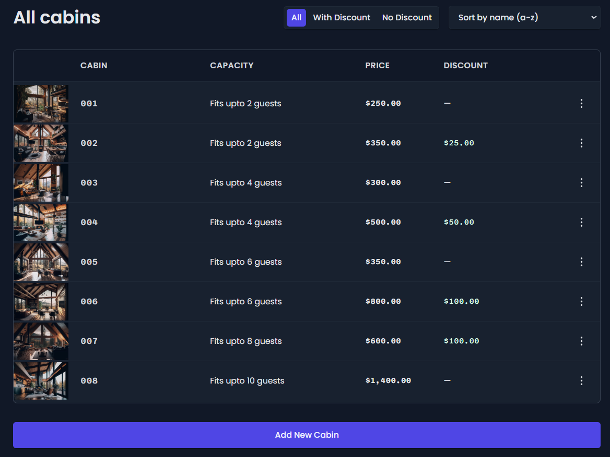

# The Wild Oasis

_An Internal Application for a Hotel to Manage Bookings & Guests._

    

 

The Wild Oasis is a web application built with React JS as the frontend, Supabase as the backend, and Styled Components for styling.

It has been specifically designed to cater to the needs of small hotels and provides a comprehensive management system for bookings and guests.

    

 

The application is highly intuitive and user-friendly, with a sleek and modern interface that makes it easy to navigate and use. Whether you are managing reservations, updating cabin information, or tracking sales, the Wild Oasis has you covered. With its powerful features and reliable performance, the Wild Oasis is the perfect tool for small hotels to streamline operations and improve their guest experience.

## NPM Packages Used

- **@supabase/supabase-js** _for interacting with the Supabase API_
- **@tanstack/react-query** _for data fetching and caching_
- **@tanstack/react-query-devtools** _for query debugging_
- **date-fns** _for date formatting_
- **react-error-boundary** _for error handling_
- **react-hook-form** _for extended form validation_
- **react-hot-toast** _for ready-made custom toast notifications_
- **react-icons** _for ready-made icons_
- **recharts** _for showing charts in the dashboard page_
- **styled-components** \*for styling the application with CSS and SCSS
